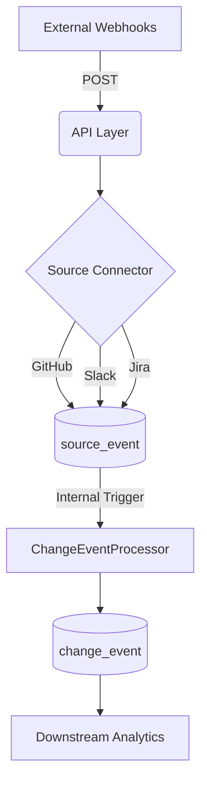

# Emiva Ingestion Pipeline

A high-performance, Flask-based webhook ingestion service designed for high-integrity data collection and automated signal merging from **GitHub**, **Slack**, and **Jira**.

## 🚀 Key Features

*   **Zero-Latency Processing**: Sources are automatically consolidated into Change Events the moment they are received.
*   **UUID-First Architecture**: Built for scale and collision resistance using UUIDs for all entity identifiers.
*   **Multi-Tenancy**: Native `workspace_id` support for isolated data streams.
*   **Intelligent Signal Merging**: Links Jira tickets, GitHub PRs, and Slack discussions into a single "Golden Record".
*   **Lossless Raw Storage**: Every incoming webhook is preserved in its raw state for full auditability.

## 🏗️ Technical Architecture

The system follows a streamlined, automated pipeline:

1.  **Capture**: Webhooks hit dedicated endpoints in `main.py`.
2.  **Persist**: The `source_event` table stores the raw payload and workspace context.
3.  **Merge (Auto)**: The `ChangeEventProcessor` is triggered instantly to link the new signal to existing or new `change_event` records.
4.  **Enrich**: Change events are populated with ticket titles, descriptions, and direct URLs for downstream use.



## 🛠️ Step-by-Step Setup

### 1. Code & Environment Setup
Clone the repository and prepare a Python environment:
```bash
# Clone the project
git clone https://github.com/EmivaAI/emivaAI-Data_pipeline.git
cd emivaAI-Data_pipeline

# Setup Virtual Environment
python -m venv venv
# Windows: .\venv\Scripts\activate | Mac/Linux: source venv/bin/activate

# Install dependencies
pip install -r requirements.txt
```

### 2. Database Initialization
Create your local SQLite database file:
```bash
python -c "from database.db import init_db; init_db()"
```

### 3. Expose the Server (ngrok)
External tools like Jira and GitHub require a public URL to send webhooks. Use **ngrok** to expose your local server:
1.  Launch ngrok in a new terminal: `ngrok http 5000`
2.  Copy the **Forwarding URL** (e.g., `https://a1b2-c3d4.ngrok-free.app`).

### 4. Configure Webhooks
Point your tools to your ngrok URL + the source-specific path:
*   **Jira**: `https://YOUR_URL/webhooks/jira`
*   **GitHub**: `https://YOUR_URL/webhooks/github`
*   **Slack**: `https://YOUR_URL/webhooks/slack`

### 5. Start Ingesting
Run the server to begin capturing and auto-processing data:
```bash
python main.py
```

---

## 🔍 Diagnostic Tools

The system includes pre-built scripts to monitor the data flow:

| Tool | Command | Description |
| :--- | :--- | :--- |
| **Source Viewer** | `python view_data.py` | Inspect the last 20 raw webhook payloads received. |
| **Change Viewer** | `python view_changes.py` | View the consolidated Change Events after processing. |

## 📊 Sample Data Examples

### 1. Source Events (`source_event`)
Initial signals with UUIDs and workspace context.

| ID (UUID) | Source Type | Workspace ID | Created At |
| :--- | :--- | :--- | :--- |
| `e6a844...` | `jira` | `alpha-uuid` | 2026-03-18 14:00:00 |
| `36d9ea...` | `github` | `beta-uuid` | 2026-03-18 14:30:00 |

### 2. Consolidated Change Events (`change_event`)
High-integrity output with ticket metadata and direct source links.

| ID (UUID) | Type | Component | Title | Ticket ID |
| :--- | :--- | :--- | :--- | :--- |
| `06dc5c...` | `feature` | `Security` | [ENG-1000] Add per-user rate limiting | `ENG-1000` |
| `682703...` | `bug_fix` | `Mobile` | [ENG-1001] Fix login crash on iOS | `ENG-1001` |

---
Developed for the **EmivaAI Ingestion Pipeline**.
